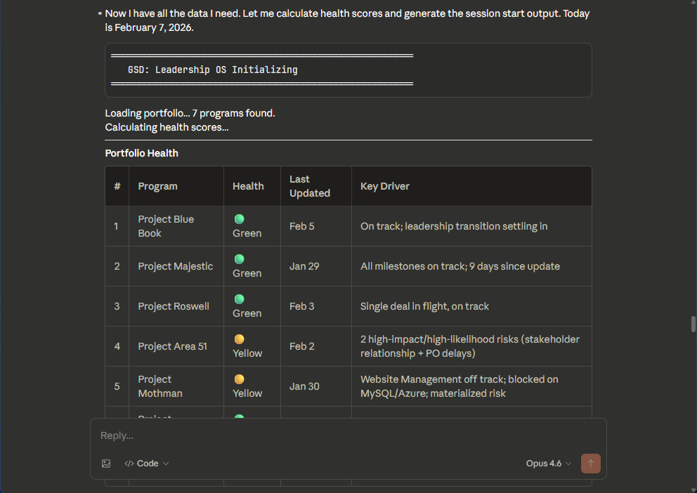
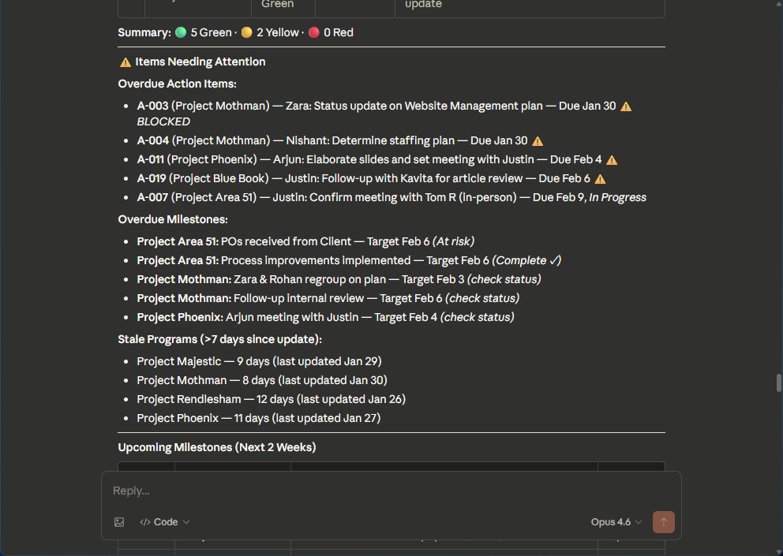
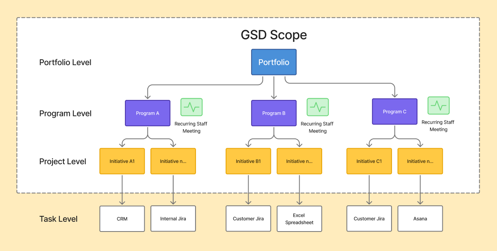
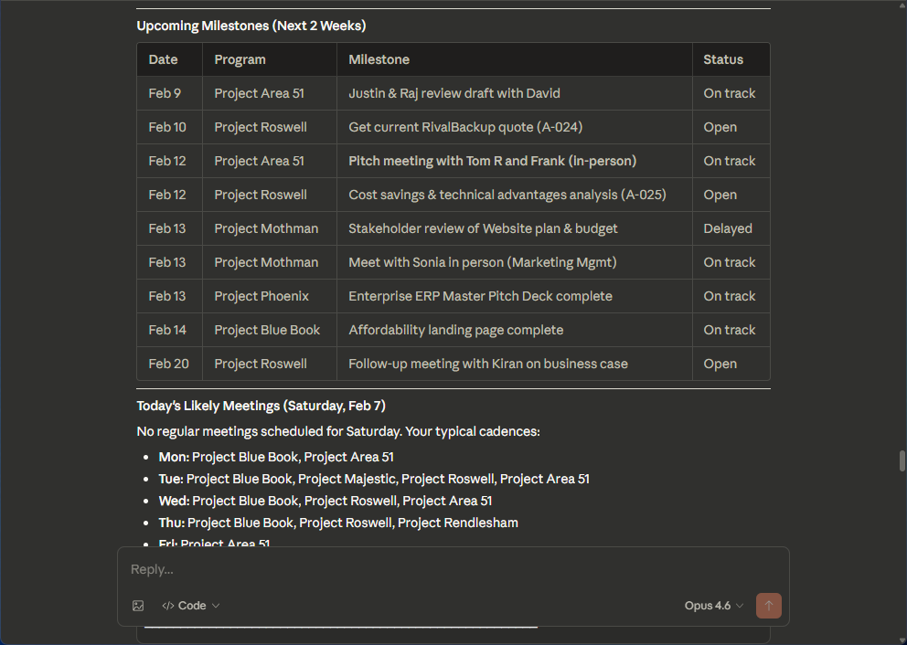
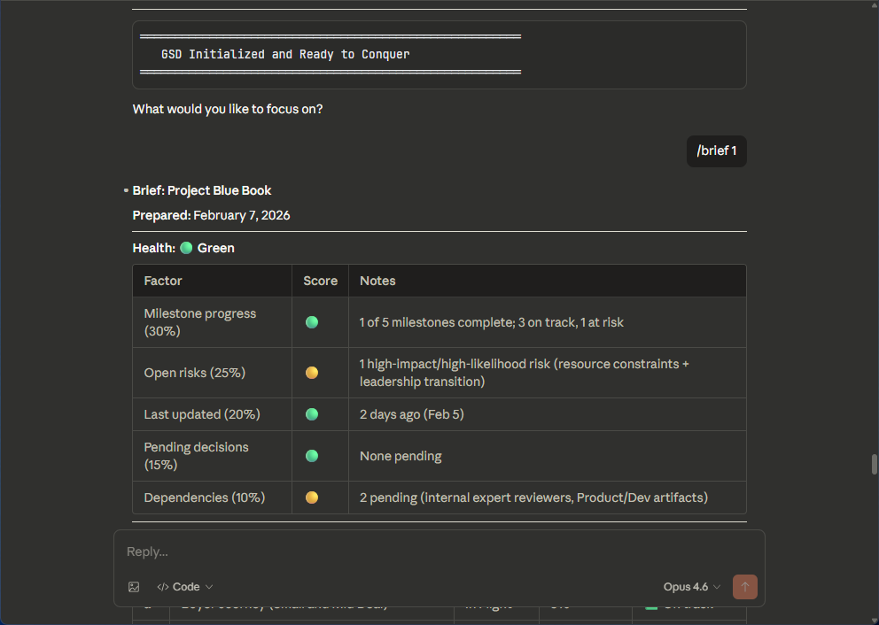
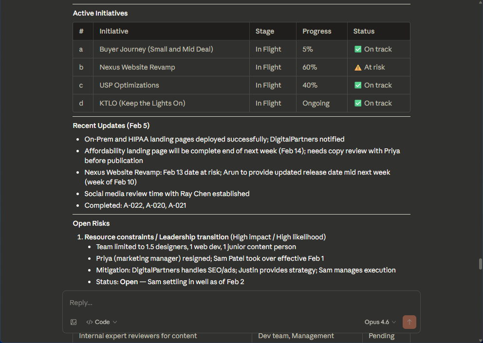
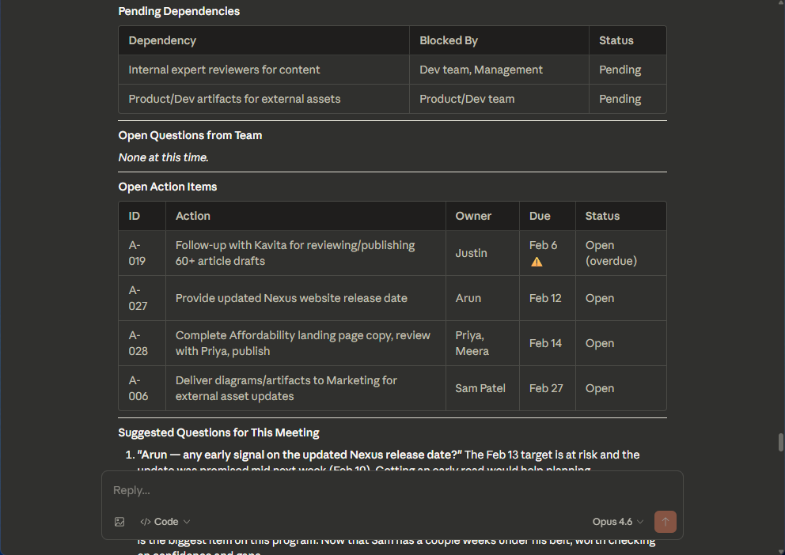
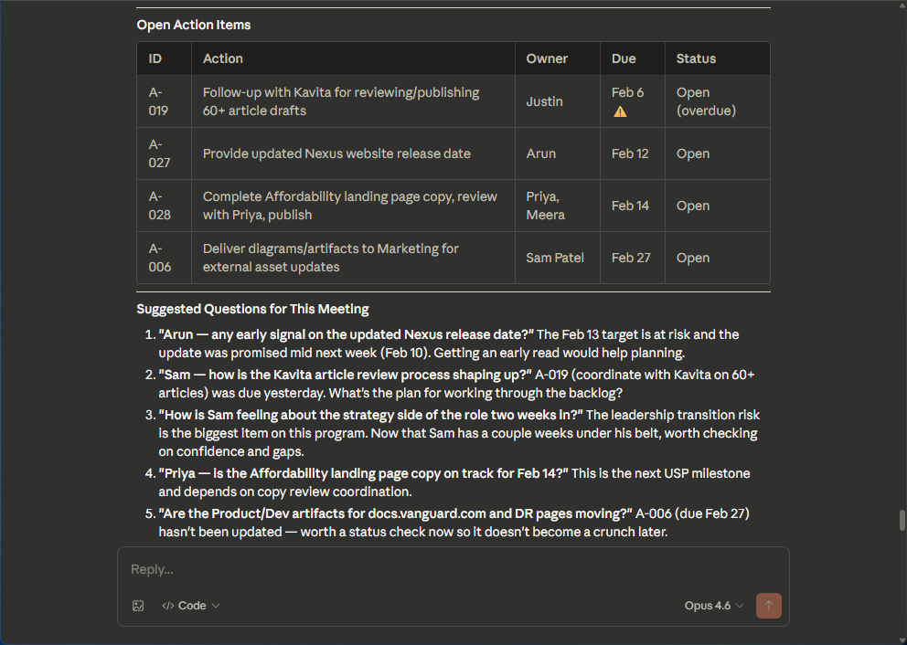
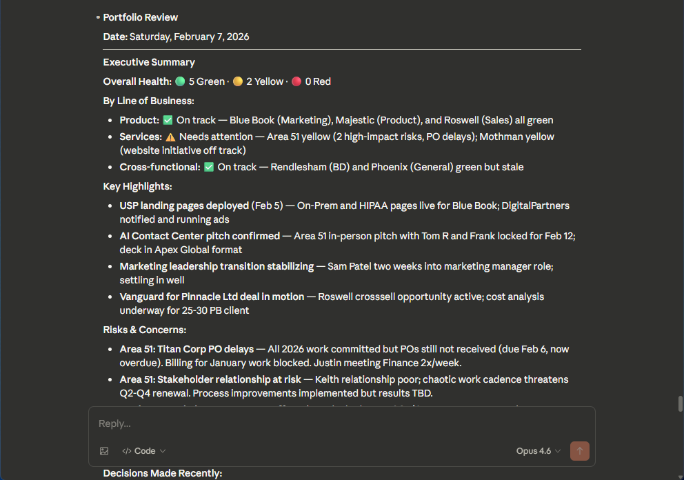
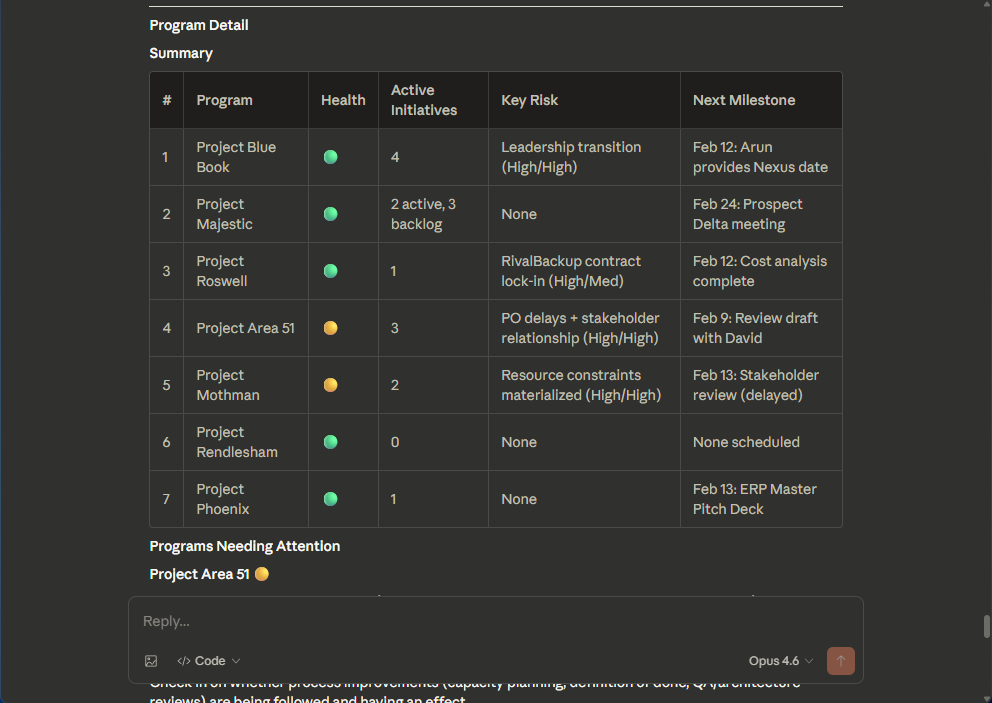

# GSD: The Leadership OS

GSD is a Portfolio Management Assistant system for senior leaders. It is built to run entirely within [Claude Code](https://claude.ai/claude-code). It provides visibility into your programs, initiatives, milestones, risks, and decisions—without requiring you to learn another tool or maintain another system.

- Keep track of a large portfolio of dissimilar projects
- Run more effective meetings
- Track the details and results of critical decisions
- Free your mind to focus on strategy

Interact with GSD in natural language, just like your own a human Portfolio Manager.

All you need to do is download the files in this repo, open Claude Code in the folder, and type `/gsd` to get started.

GSD runs primarily through **Claude Code**, with optional **[Obsidian](https://obsidian.md/)** integration for visual navigation, backlinks, and live dashboards. No MCP servers, no external services, no API keys.



## What GSD Is (and Isn't)

GSD is **not** a task manager. Your program owners and project managers have their own systems for that (Jira, Asana, CRM, spreadsheets, etc.).

GSD operates at the **leadership level**:
- Track the health of programs you oversee
- Prepare for and capture outcomes from check-in meetings
- Log major decisions with full rationale for future reference
- Surface what needs your attention across your portfolio
- Generate executive summaries when you need them



## How It Works

### Programs and Initiatives

**Programs** are the major areas you oversee—ongoing functions (Marketing, Customer Success) or time-bound efforts (Product Launch, System Migration). Each program has an owner who runs it day-to-day and reports to you.

**Initiatives** are the major workstreams within each program. They move through stages: Backlog → Evaluation → Planning → In Flight → Complete.



GSD assigns each program a **number** (1, 2, 3...) and each initiative a **letter** (a, b, c...) for quick reference. You can say "brief me on 1" or "what's happening with 2b" instead of remembering slugs.



### Meeting-Centric Workflow

GSD is built around your regular check-ins:

1. **Before a meeting**: Run `/brief 1` (or `/brief marketing`) to see current state, risks, open questions, and suggested discussion topics
2. **Have your meeting**: Focus on what matters, not on taking perfect notes
3. **After the meeting**: Run `/debrief 1` to capture updates, decisions, and action items

GSD updates program files, logs decisions, and recalculates health automatically.









### Health Scores

Each program gets a health score (🟢 Green, 🟡 Yellow, 🔴 Red) calculated from:

| Factor | Weight |
|--------|--------|
| Milestone progress | 30% |
| Open high-impact risks | 25% |
| Days since last update | 20% |
| Pending decisions | 15% |
| Dependency health | 10% |

You can override calculated health with your own assessment when needed.





## Use Cases

- **Portfolio review**: Run `/portfolio` for a full review with executive summary — health across all programs, key highlights, risks, decisions, and items needing attention
- **Meeting prep**: Run `/brief [program]` before any check-in to arrive prepared with context and smart questions
- **Decision documentation**: Run `/decision [program]` to log major decisions with rationale—your future self will thank you
- **Quick status check**: Run `/board` for a kanban view of all initiatives, or `/tree` for a hierarchical view

## Requirements

- [Claude Code](https://claude.ai/claude-code) installed and working
- [Obsidian](https://obsidian.md/) (recommended, free for personal use) — provides visual navigation, backlinks, and dashboards

## Setup

1. **Copy this template** to a folder on your machine (e.g., `~/gsd/` or wherever you keep working files)

2. **Open Claude Code** in that folder:
   ```bash
   cd ~/gsd
   claude
   ```

3. **Run the setup command**:
   ```
   /setup
   ```

4. GSD will walk you through:
   - Your profile (name, role, lines of business)
   - Your key organizational objectives
   - Each program you oversee (name, owner, meeting cadence)
   - Initial initiatives (optional)

Setup takes about 10 minutes. After that, you're ready to go.

5. **Set up Obsidian** (recommended):
   - Install [Obsidian](https://obsidian.md/) if you don't have it
   - Open Obsidian and choose "Open folder as vault"
   - Select the same folder you copied in step 1 (e.g., `~/gsd/`)
   - When prompted about community plugins, click "Enable community plugins"
   - Go to Settings > Community plugins > Browse
   - Search for and install **Dataview** by Michael Brenan
   - Search for and install **Templater** by SilentVoid
   - Enable both plugins
   - Settings are pre-configured — no additional plugin setup needed

GSD works fully without Obsidian (Claude Code is the primary interface), but Obsidian adds visual navigation, a decision dashboard, and backlink-powered knowledge graph.

## Commands

### Session Management

| Command | Description |
|---------|-------------|
| `/gsd` | Start a session. Shows portfolio health, items needing attention, upcoming milestones, and likely meetings for today. |
| `/end` | **End a session.** Saves state, logs session metrics, shows reminders. Run this when you're done working in GSD. |

### Meeting Workflow

| Command | Description |
|---------|-------------|
| `/brief [#\|slug]` | Pre-meeting prep. Shows program health breakdown, active initiatives, risks, dependencies, open questions, and suggested discussion topics. |
| `/debrief [#\|slug]` | Post-meeting capture. Walk through updates to initiatives, milestones, risks, decisions, and action items. GSD updates all relevant files. |

### Portfolio Views

| Command | Description |
|---------|-------------|
| `/board` | Kanban-style view of all initiatives by stage. Shows progress bars, health indicators, staleness warnings. |
| `/tree` | Hierarchical view of all programs and their lettered initiatives. Quick reference for the full portfolio structure. |
| `/portfolio` | Portfolio review with executive summary. Bulleted executive overview up top, detailed program-by-program analysis below. |

### Program Management

| Command | Description |
|---------|-------------|
| `/newprogram` | Add a new program to your portfolio. |
| `/decision [#\|slug]` | Log a major decision with full context: what was decided, by whom, rationale, and expected impact. |

### Help

| Command | Description |
|---------|-------------|
| `/help` | Show command reference. |

## Quick Reference

- Reference programs by **number** (`/brief 1`) or **slug** (`/brief marketing`)
- Reference initiatives by **program + letter** (`2a` = Program 2, Initiative a)
- Run `/tree` to see all programs and initiatives with their codes
- Run `/end` when you're done to ensure everything is saved

## Directory Structure

```
gsd/
├── CLAUDE.md              # System instructions (don't edit unless customizing)
├── programs/              # One markdown file per program
├── decisions/             # One file per decision (DEC-NNN-slug.md)
│   └── index.md           # Dataview-powered decision dashboard
├── state/
│   ├── portfolio-summary.md   # Your profile and program list
│   ├── decision-log.md        # Redirects to decisions/ folder
│   └── action-items.md        # Tracked action items
├── meetings/              # Meeting notes (auto-generated by /debrief)
├── sessions/              # Session logs
├── templates/             # Templates for programs, meetings, decisions
├── .obsidian/             # Obsidian vault configuration
└── .claude/               # Claude Code slash commands
```

## Tips

- **Run `/end` when you're done.** This ensures session state is saved and gives you a summary of what you accomplished.
- **Keep debriefs lightweight.** You don't need to capture everything—focus on status changes, decisions, and blockers.
- **Log decisions liberally.** The rationale matters more than the decision itself. When someone asks "why did we do X?" in six months, you'll have the answer.
- **Let health scores guide attention.** Yellow and red programs need your focus. Green programs are fine until they're not.
- **Trust the system.** GSD maintains state across sessions. Pick up where you left off.
- **Manage the context window.** You need to manage context when using LLMs, and that's true for GSD. Use the `/clear` command after running `/end`. For most users, clearing context once per day will be sufficient, but if GSD is starting to get confused, it might be time to clear. 
- **Want to modify?** Your workflow may differ. GSD is simple to tweak; just tell Claude Code what you want and it can modify GSD's underlying system fairly easily.
- **Use Obsidian for browsing.** Claude Code is your command center; Obsidian is your visual dashboard. Browse decisions, follow backlinks, and use graph view to see connections across your portfolio.
- **Decisions are individual files.** Each decision in `decisions/` is independently linkable. Use Obsidian's backlinks panel to see which programs and meetings reference any decision.

## License

MIT License. Use it, modify it, share it.

---

*GSD: Because leadership is about outcomes.*